
<h1 align="center">考研资讯平台</h1>

## 简介
考研资讯平台：角色分为管理员、用户；提供考研资讯、报考指南、资料信息、论坛交流、学生管理、订单管理、充值功能、轮播图管理和用户账号管理等综合功能，支持信息发布、用户互动和高效管理。    --计算机毕业设计源码；毕设源码；java毕业设计源码

## 联系方式

<h3 align="center">获取完整代码与数据库文件 + 微信：deepguan QQ: 86050149 QQ群: 783742310</h3>

<h3 align="center">可帮忙远程部署 包运行成功！提供远程部署、修改代码、设计文档指导、代码讲解等服务！</h3>

## 功能介绍（完整见运行截图）
管理员： 登录和注册功能允许管理员进入平台进行管理；通过网站首页导航栏和搜索功能提供资讯索引、报考指南和资料信息；管理考研及学生信息，提供图片轮播、用户信息管理、订单及帖子管理，加强平台运营；允许操作资讯增删改，及用户账户的状态变更与咨询回复。  

学生用户： 提供登录注册以便用户访问平台功能模块；访问考研资讯、专业报考指南、资料共享和论坛中心来交流与获取信息；通过信息编辑和充值功能完善及维护个人账户；在个人中心管理订单信息、查看发帖及历史交易记录。

## 运行截图
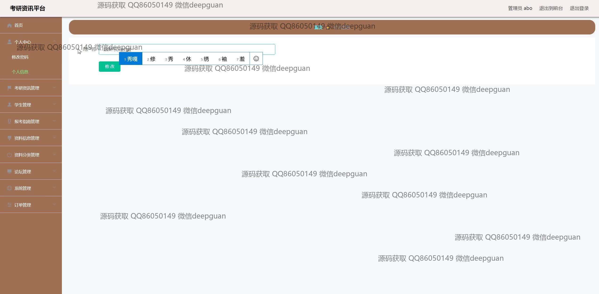
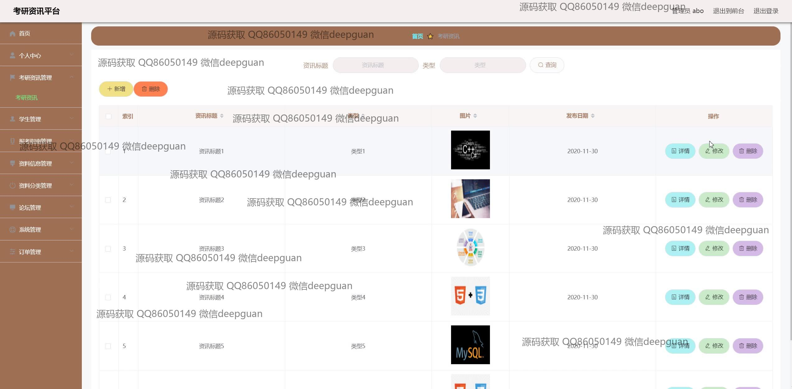
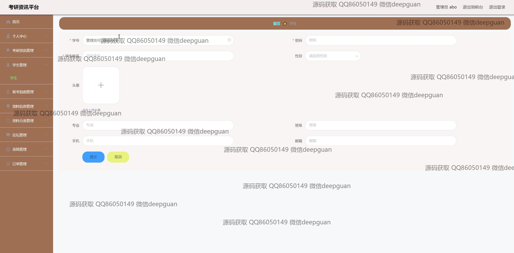
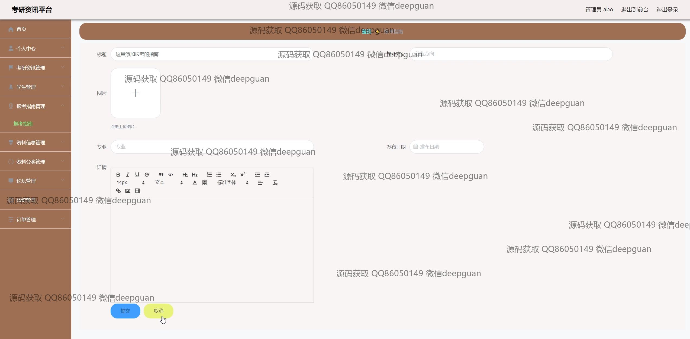
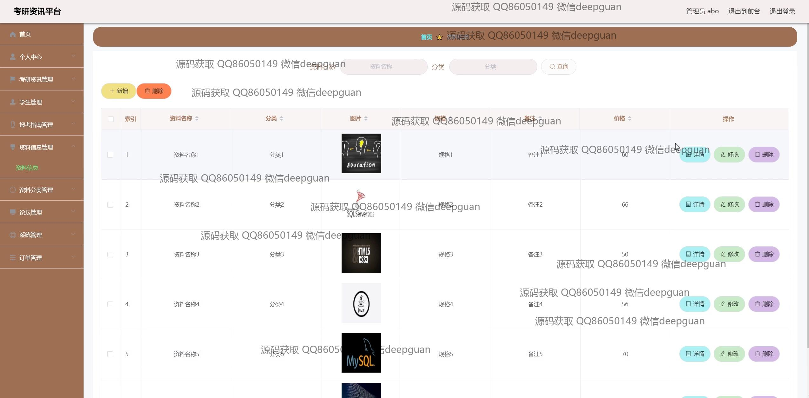
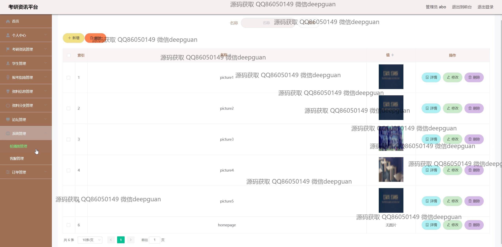
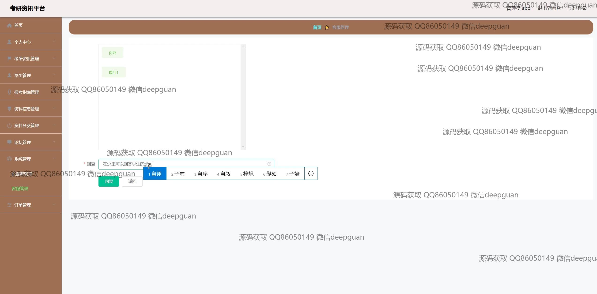
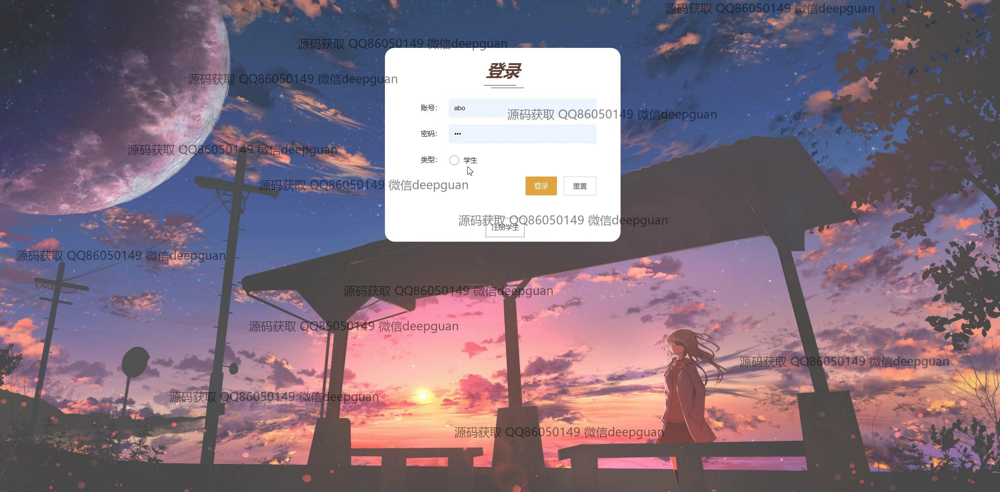
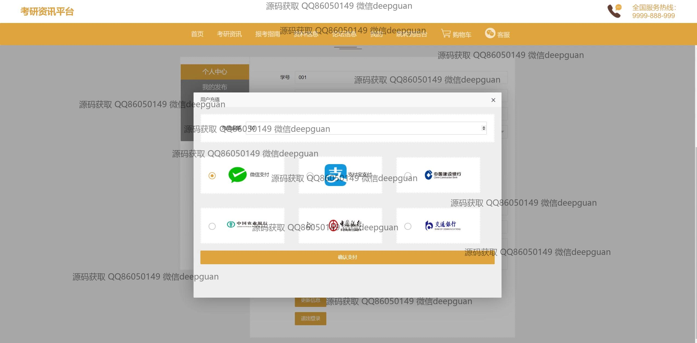
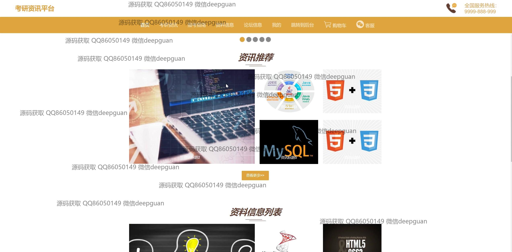

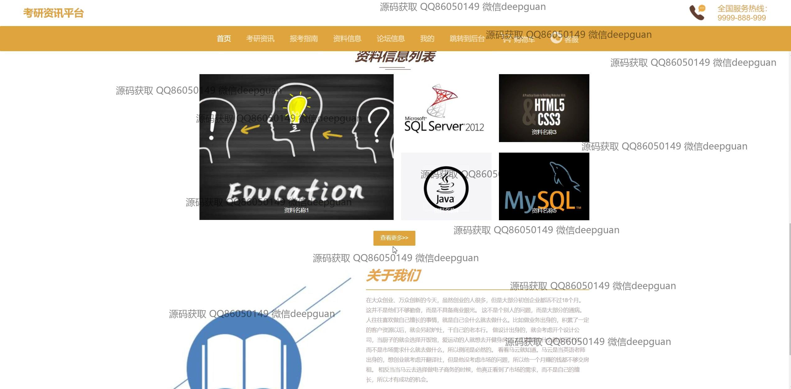
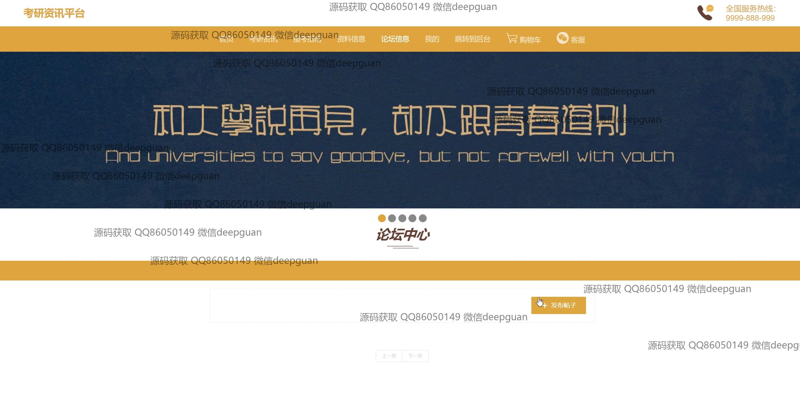
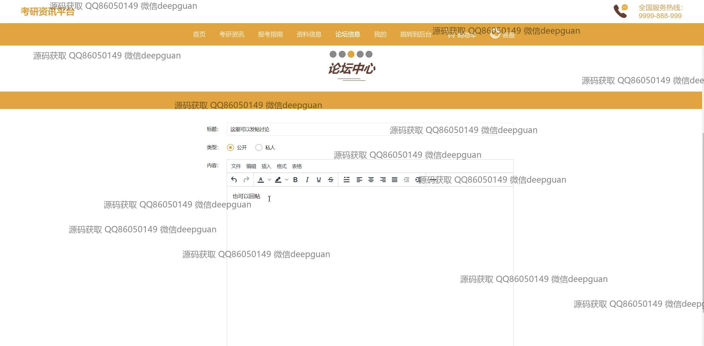
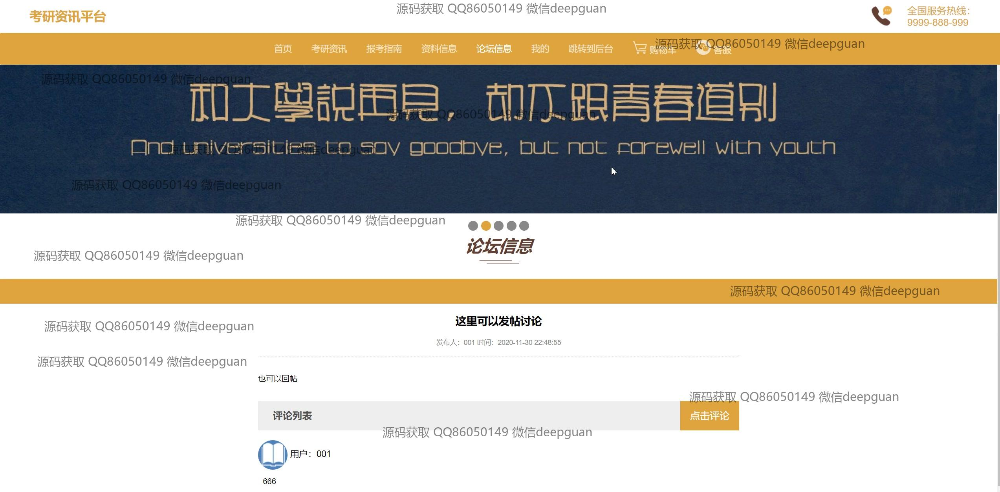
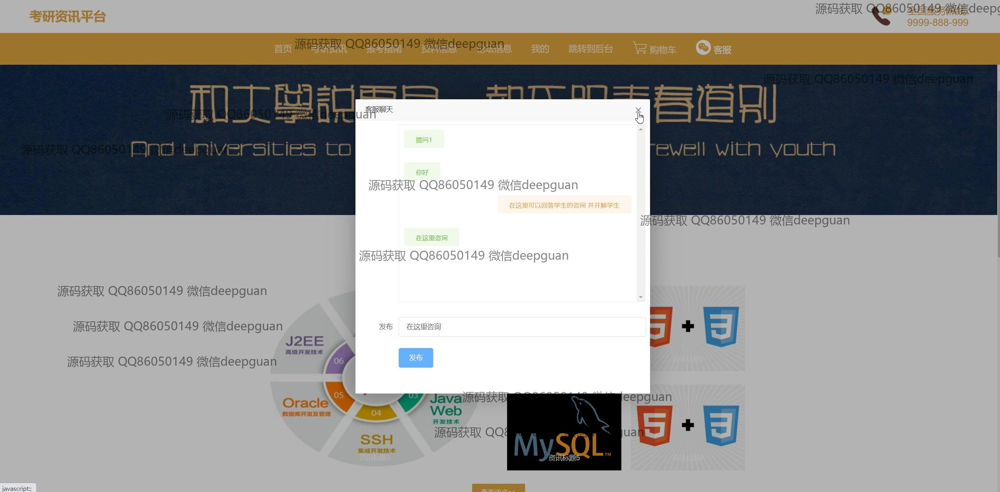
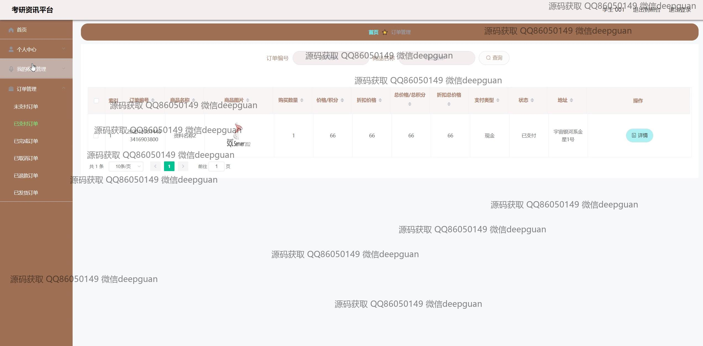
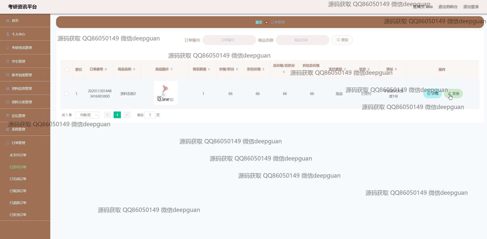
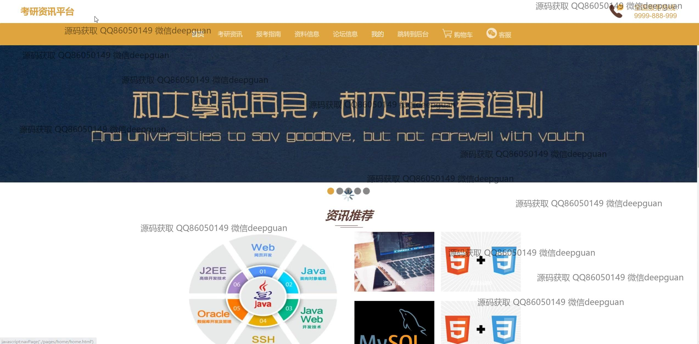

本代码来源于网络,仅供学习参考使用!

